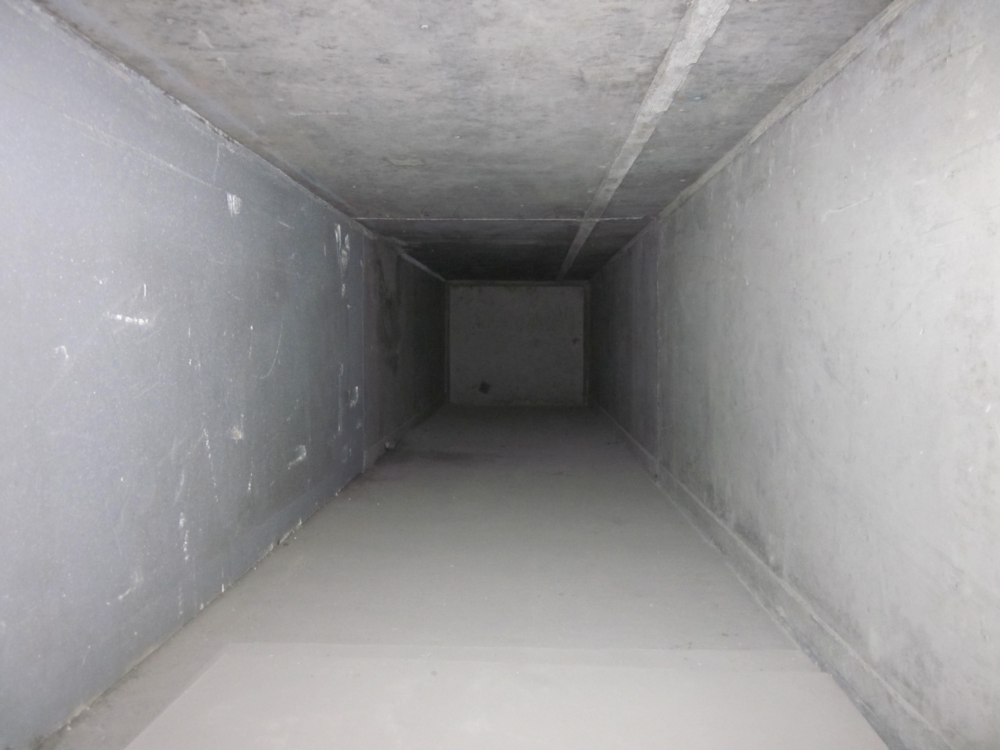
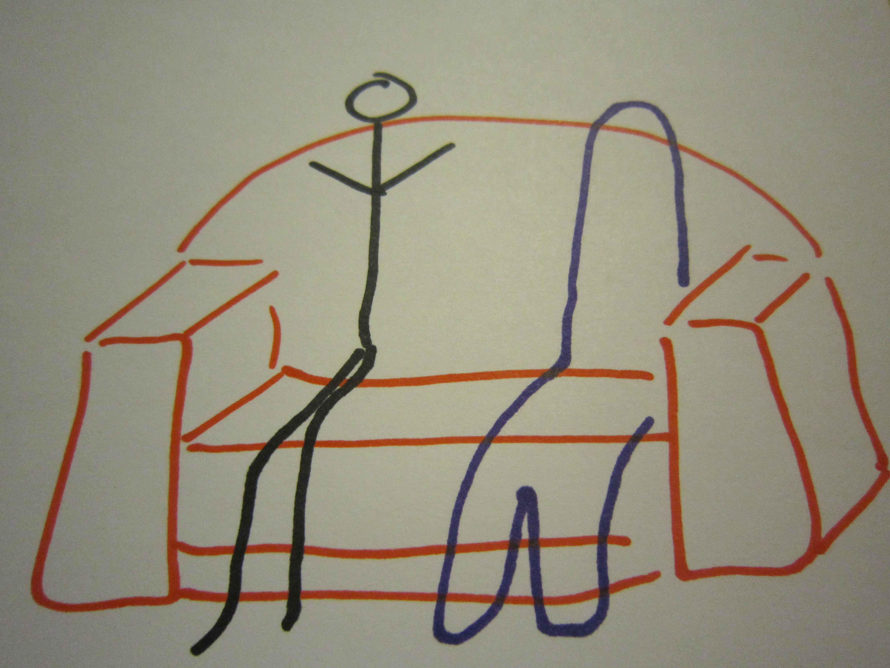
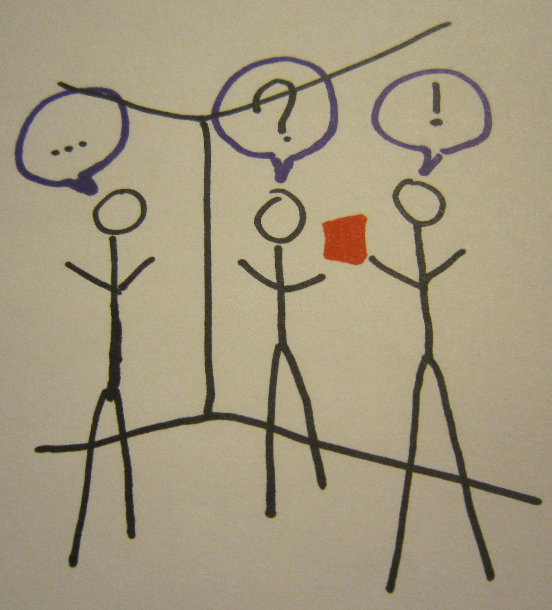
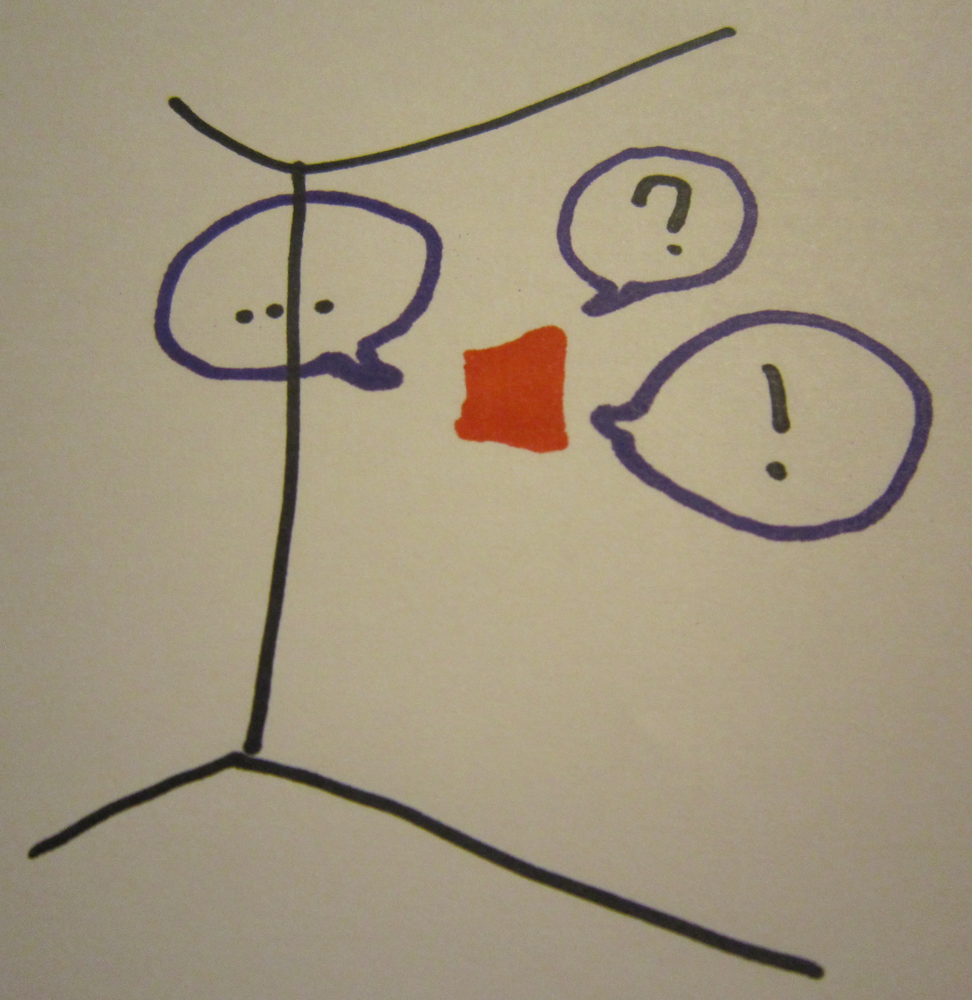
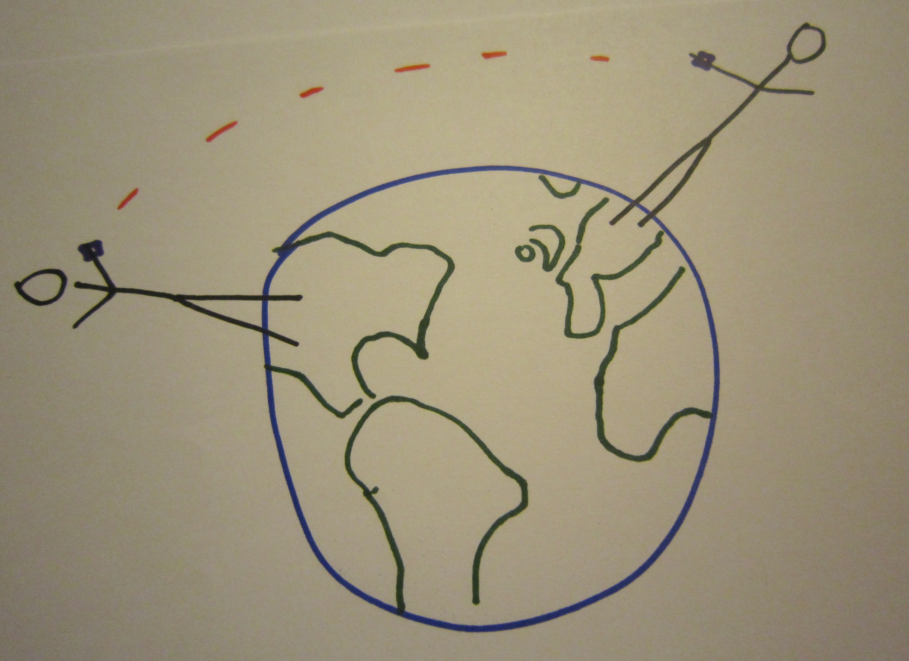
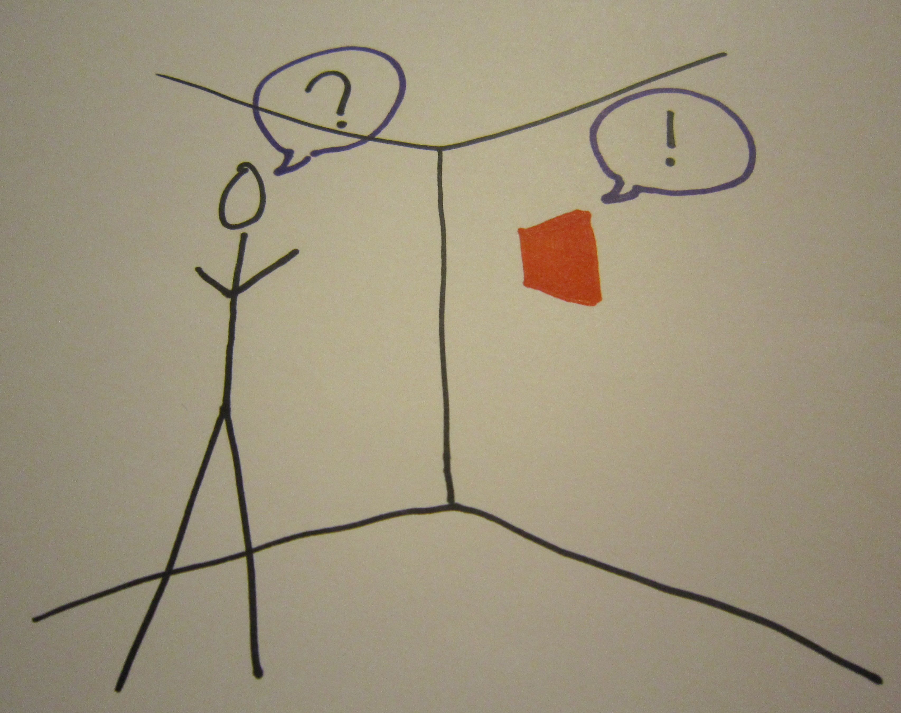

# Void

## Andrew Monks

^ I've been thinking about voids.

---

*an emptiness caused by the loss of something*

^ Specifically in the sense of loss, not a permanent void but a void condition

^ The loss of something creates a void, and the addition of something fills that void

^ People are all about filling voids

---

## Important Voids are Created by People

^ What moves in your house? people!

^ People care about people

^ so the loss of people, in whatever sense, is the most important void

---

## Speculations About Voids

^ I'd like to share some speculations about the future of void-filling

^ I'm gonna start direct and get more abstract

---

# Ghosts

^ short term void

^ partial void (person left)

^ doesn't work if everybody left cuz visual

---

^ short term void

^ partial void (person left)

^ doesn't work if everybody left cuz visual

---

# Echo

^ full void (room empty)

^ What happens when you aren't home?

^ Does your house get lonely?

^ Can hear from other room

---

^ full void (room empty)

^ What happens when you aren't home?

^ Does your house get lonely?

^ Can hear from other room

---

# Window

^ two-way communication

^ permanent

^ Automatic/simple? Manual/complicated? middle?

---

^ two-way communication

^ permanent

^ Automatic/simple? Manual/complicated? middle?

---

# Pulse

^ portable two-way communication

^ wearable

---

^ portable two-way communication

^ wearable

---

# Rosie

^ These examples have all been about bringing the lost thing back

^ What about replacing it?

^ Robot with personality: rosie from jetsons

---

^ These examples have all been about bringing the lost thing back

^ What about replacing it?

^ Robot with personality: rosie from jetsons

---
